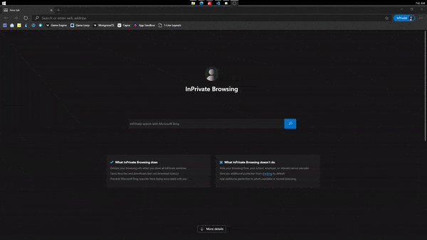

# youtube-tv-chrome

> ⏯ | A Lightweight Browser extension that enables the YouTube for TV page

## Installation

[Download the Extension here](https://github.com/angeloanan/youtube-tv-browser/releases)

**Chrome**: [Installation Guide](https://www.mattcutts.com/blog/how-to-install-a-chrome-extension-from-github/)\
**Firefox**: [Installation Guide](https://extensionworkshop.com/documentation/publish/distribute-sideloading/#install-addon-from-file)

## Usage

Simply navigate to https://youtube.com/tv and enjoy your videos.

No, seriously, I've designed this extension to be an "*install-and-forget*" extension.

## Demo

\
*Do you seriously need it?*

## How does this work

This extension modifies the User Agent of the request to look like its coming from an actual TV. It modifies the HTTP request headers

